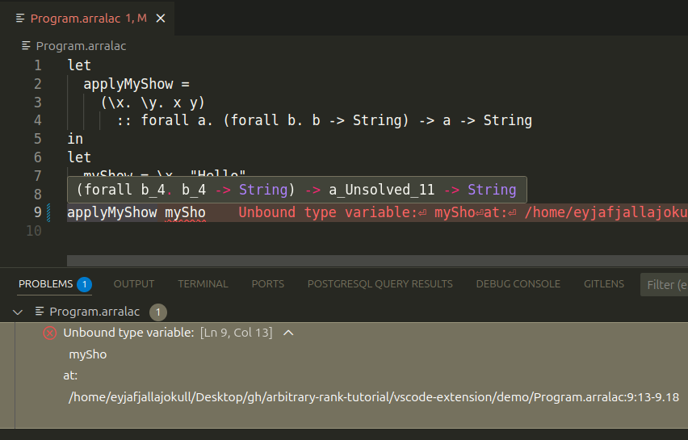

[](https://github.com/deemp/arbitrary-rank-tutorial/actions/workflows/ci.yaml)

# A Tutorial Implementation of a Lambda Calculus with Parametric Predicative Arbitrary-Rank Polymorphism

`Arralac` - `Ar`bitrary-`ra`nk + `la`mbda `c`alculus.

## Interactive features

- [Language Server](./arralac/src/Language/Arralac/LanguageServer/Run.hs)
  - Supports showing types of variables on hover and error diagnostics when something goes wrong.
- [Command-Line Interface](./arralac/src/Language/Arralac/CLI/Run.hs)
  - Supports running a language server, typechecking programs, and evaluating them.

## Examples

### Initial program

[arralac/test/data/Program1.arralac](./arralac/test/data/Program1.arralac)

```console
let
  applyMyShow =
    (\x. \y. x y)
      :: forall a. (forall b. b -> String) -> a -> String
in
let
  myShow = \x. "Hello"
in
applyMyShow myShow
```

### VS Code extension



### Typecheck

```console
nix run .#arralac -- typecheck arralac/test/data/Program1.arralac
```

```console
(
  let
    applyMyShow_0 =
      (
        (
          (
            (
              \(x_1 :: forall b_4. b_4 -> String).
                (
                  (
                    \(y_2 :: a_9).
                      (
                        (
                          (
                            (x_1 :: a_9 -> String)
                          )
                            (y_2 :: a_9)
                        ) :: String
                      )
                  ) :: a_9 -> String
                )
            ) :: (forall b_4. b_4 -> String) -> a_9 -> String
          ) :: {forall a_3. forall b_4. b_4 -> String -> a_3 -> String}
        ) :: (forall b_4. b_4 -> String) -> a_Unsolved_11 -> String
      ) :: (forall b_4. b_4 -> String) -> a_Unsolved_11 -> String
  in
    (
      let
        myShow_7 =
          (
            (
              \(x_8 :: b_13).
                (
                  "Hello"
                )
            ) :: b_13 -> String
          ) :: b_13 -> String
      in
        (
          (
            (applyMyShow_0 :: (forall b_4. b_4 -> String) -> a_Unsolved_11 -> String)
          )
            (myShow_7 :: b_13 -> String)
        ) :: a_Unsolved_11 -> String
    ) :: a_Unsolved_11 -> String
) :: a_Unsolved_11 -> String
```

### Evaluate

```console
nix run .#arralac -- evaluate whnf arralac/test/data/Program1.arralac
```

```console
\y_2. (\x_8. "Hello") (y_2)
```

## Pipeline: reading a file to evaluating Core

The system performs several steps to transform an input text into an evaluated term.

Here are these steps and associated system components.

### Reading an input file

- [Reader](./arralac/src/Language/Arralac/Reader/Run.hs)
  - Reads the input file as text.

### Parsing

- [Parser](./arralac/src/Language/Arralac/Parser/Run.hs)
  - Produces an initial program abstract syntax tree (AST) from the input text.
  - Types for that AST in [Parser/Generated/Abs](./arralac/src/Language/Arralac/Parser/Generated/Abs.hs) were generated by `BNFC` [^BNFC] from an LBNF [^LBNF] description of the language syntax defined in [Arralac.cf](./arralac/grammar/Arralac.cf).
  - The lexer and parser as Haskell code were generated using `BNFC` [^BNFC], `happy` [^happy], and `alex` [^alex] from the same description.  

### Renaming

- [Renamer](./arralac/src/Language/Arralac/Renamer/ConvertParsed.hs)
  - Assigns a unique identifier to each term and type variable.
  - Supports shadowing.

### Typechecking

I used the bidirectional typechecking algorithm described in the paper *Practical type inference for arbitrary-rank types* [^JONES2007] and modified it to gather constraints without solving them.

This approach was suggested in [^JONES2007] and mentioned by *The Glasgow Haskell Compiler* author Simon Peyton Jones at WITS'24 [^WITS2024] where he talked about solving constraints after and during type inference.

#### Gathering constraints on types

- [Typechecker](./arralac/src/Language/Arralac/Parser/Run.hs)
  - Collects "wanted" [^WITS2024] equality constraints (where a metavariable equals a monotype) to later be solved by the constraint solver.
  - Sets a level of each variable to enable skolem escape checking and generalization by levels.
  - Limitations:
    - Does not support `let`-generalization unlike the implementation in the paper [^JONES2007].

      The `let`-generalization feature is relatively easy to implement by running the solver during  typechecking at each implication and quantifying over unsolved variables with a greater than ambient level [^WITS2024].

    - Does not yet support "given" [^WITS2024] constraints (e.g., type class instances).

      The implemented language doesn't have features like type equality constraints, type classes, and GADTs that could produce such constraint [^WITS2024].

#### Solving constraints on types

- [Constraint Solver](./arralac/src/Language/Arralac/Solver/Run.hs)
  - Iteratively solves equality constraints.
  - Performs an occurs check for each constraint so that the metavariable on the left-hand side of the constraint doesn't appear in the type on the right-hand sind of the constraint.
  - Identifies skolem escape using variable levels.
  - Limitations:
    - Does not solve floating-out.
    - Unsolved metavariables remain as is.

#### Getting rid of metavariables

- [Zonker](./arralac/src/Language/Arralac/Zonker/Zn/Zonk.hs)
  - Runs after the `Solver`.
  - Esures that all metavariables get replaced by their fully solved types.
  - Converts typed terms to a representation where no metavariables may occur.

### Enabling safe term transformations

- [Core/ConvertZonked](./arralac/src/Language/Arralac/Core/ConvertZonked.hs)
  - Provides functions for converting a fully zonked term into the Core representation.

    Some functions from the `free-foil` [^free-foil] library were copied and modified locally:
      1. to support binders with richer information such as [CoreNameBinder](./arralac/src/Language/Arralac/Core/CoreNameBinder.hs);
      1. to use the variable identifiers from the zonked term.
  
### Evaluating terms

- [Evaluator](arralac/src/Language/Arralac/Evaluator/Run.hs)
  - Uses `free-foil` [^free-foil] functions for calculating the weak head normal form [^WhnfHaskellWiki] of a Core term.

## AST representations

Each step of the [pipeline](#pipeline-reading-a-file-to-evaluating-core) works with at most two different AST representations.

Here are these representations.

### Parser/Generated/Abs

[Parser/Generated/Abs](arralac/src/Language/Arralac/Parser/Generated/Abs.hs) is generated by BNFC [^BNFC].

### Syntax/TTG

[Syntax/TTG](arralac/src/Language/Arralac/Syntax/TTG/) is the Trees that Grow [^TTG] (TTG) representation of the AST. The TTG approach enables reusing existing data type definitions using type families and their applications in the data type constructor fields.

This approach is used in GHC [^GhcTtg].

On the one hand, data types become extremely flexible and reusable.

On the other hand, there appears a significant overhead in terms of lines of code written to define type family instances.

### Syntax/Local

[Syntax/Local](arralac/src/Language/Arralac/Syntax/Local/) instantiates type families defined in [Syntax/TTG] depending on one of the "passes". The three passes are defined in [Prelude/Pass](./arralac/src/Language/Arralac/Prelude/Pass.hs) and mean roughly the following:

1. `Renamed` - after the renamer ran on the intial AST.
1. `Typechecked` - after the typechecker ran on a renamed term.
1. `Zonked` - after the zonker ran on a fully typechecked term.

### Core/AST

[Core/AST](./arralac/src/Language/Arralac/Core/AST.hs)

- Provides a representation for terms based on the `free-foil` [^free-foil] library.

  This representation enables capture-avoiding substitution which can be used for evaluating terms.

- Limitations:

  - `let`-bindings are not recursive. So, terms like `let binder = <right-hand side contatining a> in <body>` are not supported.

    There is a not particularly clean way to make the right-hand side and the body scoped under a binder:

    - Create a node for a `let`-binding that contains a term scoped under a binder. So, [Node](https://hackage.haskell.org/package/free-foil-0.2.0/docs/Control-Monad-Free-Foil.html#t:AST) with a [ScopedAST](https://hackage.haskell.org/package/free-foil-0.2.0/docs/Control-Monad-Free-Foil.html#t:ScopedAST).
    - Create a separate node for unscoped ([AST](https://hackage.haskell.org/package/free-foil-0.2.0/docs/Control-Monad-Free-Foil.html#t:AST)) right-hand side and body.
    - Use the `PatternSynonyms` extension of GHC to construct and deconstruct `let`-bindings in the AST.

## Install `arralac`

```console
nix profile install github:deemp/arbitrary-rank-tutorial#arralac
```

### Use temporarily

Run devshell.

```console
nix develop github:deemp/arbitrary-rank-tutorial#demo
```

Run `arralac` in that devshell.

```console
arralac
```

## Use VS Code extension

Supported platforms: Linux, MacOS with `Nix` installed (NixOS isn't necessary).

The following instructions were tested on Ubuntu 24.04 with `Nix` installed.

1. Install `arralac` (see [Install arralac](#install-arralac)).

1. Clone and enter the repository.

    ```console
    git clone https://github.com/deemp/arbitrary-rank-tutorial
    cd arbitrary-rank-tutorial
    ```

1. Open the directory containing the VS Code extension code.
  
    ```console
    code vscode-extension
    ```

1. Type `Fn` + `F5` to start debugging the extension.

1. In the new VS Code window that opens automatically, find and open the `arbitrary-rank-tutorial/vscode-extension/demo/Program.arralac` file.

1. Hover over an identifier. You should see the type of that identifier.

1. Try to edit the code. You should see error messages when the program cannot be parsed or some identifiers dont exist where you mention them (unbound variables).

## Develop the project

### Clone the repository

```console
git clone https://github.com/deemp/arbitrary-rank-tutorial
cd arbitrary-rank-tutorial
```

### Set up direnv (optional)

Direnv caches flake devshell evaluation results.

Install `direnv` [^direnv].

Run in the repo:

```console
direnv allow
```

### Set up VS Code (optional)

Install recommended extensions (listed in [.vscode/extensions.json](.vscode/extensions.json)).

### Build and run with Nix

Build `arralac`.

```console
nix build .#arralac
```

Run `arralac`.

```console
nix run .#arralac -- typecheck arralac/test/data/Program1.arralac

nix run .#arralac -- evaluate whnf arralac/test/data/Program1.arralac
```

### Build and run with Cabal

Start a Nix devShell.

```console
nix develop
```

Update the Hackage index.

```console
nix run .#cabalUpdate
```

Build `arralac`.

```console
cabal build arralac
```

Run `arralac`.

```console
cabal run arralac -- typecheck arralac/test/data/Program1.arralac

cabal run arralac -- evaluate whnf arralac/test/data/Program1.arralac
```

### Build with Stack

Start a Nix devShell.

```console
nix develop
```

Build `arralac`.

```console
stack build arralac
```

Run `arralac`.

```console
stack run -- arralac typecheck arralac/test/data/Program1.arralac
```

## Statistics

```console
nix develop -c cloc arralac/src/ --exclude-dir Generated
```

```console
      82 text files.
      82 unique files.                              
       1 file ignored.

github.com/AlDanial/cloc v 2.04  T=0.02 s (3363.3 files/s, 231328.4 lines/s)
-------------------------------------------------------------------------------
Language                     files          blank        comment           code
-------------------------------------------------------------------------------
Haskell                         82            694           1080           3866
-------------------------------------------------------------------------------
SUM:                            82            694           1080           3866
-------------------------------------------------------------------------------
```

[^BNFC]: <https://bnfc.readthedocs.io/en/latest/#>

[^WITS2024]: <https://www.youtube.com/watch?v=OISat1b2-4k>

[^JONES2007]: <https://www.cambridge.org/core/journals/journal-of-functional-programming/article/practical-type-inference-for-arbitraryrank-types/5339FB9DAB968768874D4C20FA6F8CB6>

[^happy]: <https://haskell-happy.readthedocs.io/en/latest/>

[^alex]: <https://haskell-alex.readthedocs.io/en/latest/>

[^free-foil]: <https://hackage.haskell.org/package/free-foil>

[^LBNF]: <https://bnfc.readthedocs.io/en/latest/lbnf.html>

[^WhnfHaskellWiki]: <https://wiki.haskell.org/Weak_head_normal_form>

[^direnv]: <https://direnv.net/#basic-installation>

[^TTG]: <https://www.cs.tufts.edu/comp/150FP/archive/simon-peyton-jones/trees-that-grow.pdf>

[^GhcTtg]: <https://gitlab.haskell.org/ghc/ghc/-/wikis/implementing-trees-that-grow>
