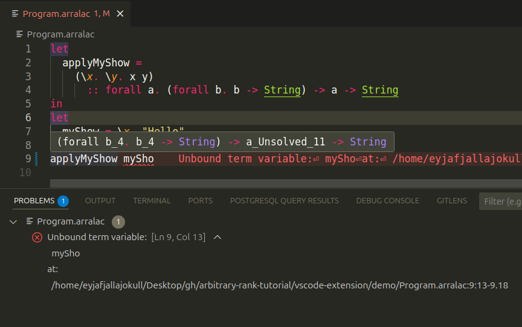

[](https://github.com/deemp/arbitrary-rank-tutorial/actions/workflows/ci.yaml)

# A Tutorial Implementation of a Lambda Calculus with Parametric Predicative Arbitrary-Rank Polymorphism

`Arralac` - `Ar`bitrary-`ra`nk + `la`mbda `c`alculus.

## Interactive features

- [Language server](./arralac/src/Language/Arralac/LanguageServer/Run.hs)
  - Supports showing types of variables on hover and error diagnostics when something goes wrong.
- [Command-line interface](./arralac/src/Language/Arralac/CLI/Run.hs)
  - Supports running a language server, typechecking programs, and evaluating them.

## Examples

### Initial program

[arralac/test/data/Program1.arralac](./arralac/test/data/Program1.arralac)

```console
let
  applyMyShow =
    (\x. \y. x y)
      :: forall a. (forall b. b -> String) -> a -> String
in
let
  myShow = \x. "Hello"
in
applyMyShow myShow
```

### VS Code extension



### Typecheck

```console
nix run .#arralac -- typecheck arralac/test/data/Program1.arralac
```

```console
(
  let
    applyMyShow_0 =
      (
        (
          (
            (
              \(x_1 :: forall b_4. b_4 -> String).
                (
                  (
                    \(y_2 :: a_9).
                      (
                        (
                          (
                            (x_1 :: a_9 -> String)
                          )
                            (y_2 :: a_9)
                        ) :: String
                      )
                  ) :: a_9 -> String
                )
            ) :: (forall b_4. b_4 -> String) -> a_9 -> String
          ) :: {forall a_3. forall b_4. b_4 -> String -> a_3 -> String}
        ) :: (forall b_4. b_4 -> String) -> a_Unsolved_11 -> String
      ) :: (forall b_4. b_4 -> String) -> a_Unsolved_11 -> String
  in
    (
      let
        myShow_7 =
          (
            (
              \(x_8 :: b_13).
                (
                  "Hello"
                )
            ) :: b_13 -> String
          ) :: b_13 -> String
      in
        (
          (
            (applyMyShow_0 :: (forall b_4. b_4 -> String) -> a_Unsolved_11 -> String)
          )
            (myShow_7 :: b_13 -> String)
        ) :: a_Unsolved_11 -> String
    ) :: a_Unsolved_11 -> String
) :: a_Unsolved_11 -> String
```

### Evaluate

```console
nix run .#arralac -- evaluate whnf arralac/test/data/Program1.arralac
```

```console
\y_2. (\x_8. "Hello") (y_2)
```

## AST representations

Each step of the [pipeline](#pipeline-reading-a-file-to-evaluating-core) works with at most two different AST representations.

Here are these representations.

### Parser.Generated.Abs

[Parser.Generated.Abs](arralac/src/Language/Arralac/Parser/Generated/Abs.hs) is generated by BNFC [^BNFC].

### Syntax

#### Trees that Grow

The core idea of the Trees that Grow [^TreesThatGrow] approach is to parameterise a data type with a type variable and use type-level expressions involving type families and that type parameter in the fields of the data type constructors.

Then, it will be possible to produce different variants of the data type by instantiating the parameter and the type families.

On the one hand, data types become extremely flexible and reusable.

On the other hand, there appears a significant overhead in terms of lines of code written to define type family instances.

#### Syntax.TTG

[Syntax.TTG](arralac/src/Language/Arralac/Syntax/TTG/) provides Trees that Grow [^TreesThatGrow] (TTG) representations of the AST and the `Type` (see [Type.TTG.Type](arralac/src/Language/Arralac/Type/TTG/Type.hs) for a discussion of why use TTG for `Type`).

GHC also uses the TTG representation for its syntax [^GhcTreesThatGrow] but not for its `Type` [^GhcType].

#### Pass.Types

[Pass.Types](./arralac/src/Language/Arralac/Pass/Types.hs) provides types that are used for instantiating TTG definitions to concrete types. These types denote the following passes:

1. `Renamed` - after the renamer ran on the intial AST.
1. `Typechecked` - after the typechecker ran on a renamed term.
1. `Zonked` - after the zonker ran on a fully typechecked term.

#### Syntax.Local

[Syntax.Local](./arralac/src/Language/Arralac/Syntax/Local/) instantiates type families defined in [Syntax.TTG](./arralac/src/Language/Arralac/Syntax/TTG/) depending on one of the passes.

### Core

- GHC has a Core representation of Haskell programs based on the System FC [^GhcSystemFcOutdated][^GhcSystemFcCurrent].

- [Core.AST](./arralac/src/Language/Arralac/Core/AST.hs) provides a Core language representation based on untyped lambda calculus [^LambdaCalculusIntroduction]. It only has lambda abstraction, application, `let`-bindings and literals.

  - The Core `AST` with scoped bindings is constructed via the `free-foil` [^FreeFoilLibrary] library. This representation enables capture-avoiding substitution which can be used for evaluating terms.

- Limitations of the `Core.AST`:

  - `let`-bindings are not recursive. Hence, terms like `let binder = <right-hand side contatining the binder> in <body>` are not supported.

    There is a way to make the right-hand side and the body scoped under a binder:

    - In the AST type, create a constructor for a `let`-binding that contains a term scoped under a binder. It will be used in a [Node](https://hackage.haskell.org/package/free-foil-0.2.0/docs/Control-Monad-free-foil.html#t:AST) with a [ScopedAST](https://hackage.haskell.org/package/free-foil-0.2.0/docs/Control-Monad-free-foil.html#t:ScopedAST).
    - Create another constructor for unscoped ([AST](https://hackage.haskell.org/package/free-foil-0.2.0/docs/Control-Monad-free-foil.html#t:AST)) right-hand side and body. It will be wrapped in that `ScopedAST` that introduced the `let`-binder.
    - Use the `PatternSynonyms` extension of GHC to construct and deconstruct `let`-bindings in the AST.
    - Limitations:
      - Since a `let`-binding is represented with two constructors now, it will be possible to construct non-well-formed terms.

## Pipeline: reading a file to evaluating Core

The system performs several steps to transform an input text into an evaluated term.

Here are these steps and associated system components.

### Reading an input file

- [Reader](./arralac/src/Language/Arralac/Reader/Run.hs)
  - Reads the input file as plain text.

### Parsing

- [Parser](./arralac/src/Language/Arralac/Parser/Run.hs)
  - Produces an initial abstract syntax tree (AST) from the input text.
  - The tree nodes get annotated with positions in the source code.
  - Types for the AST in [Parser.Generated.Abs](./arralac/src/Language/Arralac/Parser/Generated/Abs.hs) were generated by `BNFC` [^BNFC] from an LBNF [^LBNF] description of the language syntax defined in [Arralac.cf](./arralac/grammar/Arralac.cf).
  - The lexer and parser as Haskell code were generated using `BNFC` [^BNFC], `happy` [^happy], and `alex` [^alex] from the same description.  

### Renaming

- [Renamer](./arralac/src/Language/Arralac/Renamer/Run.hs)
  - Performs $\alpha$ conversion [^AlphaConversion] of the parsed term by assigning a unique identifier to each binder. All occurences of a binder have the same identifier but different information about their position in the source code (see [Syntax.Local.Name](./arralac/src/Language/Arralac/Syntax/Local/Name.hs)).
  - Supports shadowing.

### Typechecking

I used the bidirectional typechecking algorithm described in the paper *Practical type inference for arbitrary-rank types* [^PracticalTypeInferenceForArbitraryRankTypes] and modified it to gather constraints without immediately solving them.

This approach was suggested in [^PracticalTypeInferenceForArbitraryRankTypes] and explained in detail by *The Glasgow Haskell Compiler* [^GHC] author Simon Peyton Jones at WITS'24 [^WITS2024] where he talked about solving constraints during and after type inference.

#### Gathering constraints on types

- [Typechecker](./arralac/src/Language/Arralac/Typechecker/Run.hs)
  - Gathers "wanted" (constraints that should be solved) [^WITS2024] equality constraints (where a metavariable equals a monotype).
  - Sets the level for each variable to enable skolem escape checking [^WITS2024] [^PracticalTypeInferenceWithLevels].
  - Variables are created at an ambient level.
  - At each skolemization of a lambda abstraction where the binder has a user-given $\sigma$-type [^WITS2024] [^PracticalTypeInferenceForArbitraryRankTypes] [^GHC]:
    - Creates an implication constraint with the ambient level.
    - Converts binders from the `forall` part of the type into skolems at the ambient level and adds them into the implication constraint.
    - Increments the ambient level and gathers constraints for the body.
    - Writes these constraints into the implication constraint and emits it.
  - Limitations:
    - Does not support `let`-generalization unlike the implementation in the paper [^PracticalTypeInferenceForArbitraryRankTypes].

      The `let`-generalization feature is relatively easy to implement by running the solver during  typechecking at each implication and quantifying over unsolved variables with a greater than ambient level [^WITS2024].

      GHC does support `let`-generalization, including that of *local* `let`-bindings. These bindings can appear nested in function bodies and other `let`-bindings [^MonoLocalBinds].

    - Does not yet support "given" [^WITS2024] constraints (e.g., type class instances).

      The implemented language doesn't have features like type equality constraints, type classes, and GADTs that could produce such constraint [^WITS2024].

#### Solving constraints on types

- [Solver](./arralac/src/Language/Arralac/Solver/Run.hs)
  - Iteratively solves equality constraints.
  - Performs an occurs check for each constraint so that the metavariable on the left-hand side of the constraint doesn't appear in the type on the right-hand sind of the constraint.
  - Identifies skolem escape using variable levels. A metavariable that has the level $n$ may not be unified [^PracticalTypeInferenceForArbitraryRankTypes] with another variable or a type containing a variable that has the level $m$ if $m > n$ [^WITS2024] [^PracticalTypeInferenceWithLevels].
  - Unsolved metavariables remain unchanged.
  - Limitations:
    - Does not try to float equality constraints outside of implication constraints [^OutsideInX] [^GHC].

#### Getting rid of metavariables

- [Zonker](./arralac/src/Language/Arralac/Zonker/Zn/Zonk.hs)
  - Runs after the `Solver`.
  - Converts typed terms to a representation where no metavariables may occur.
    - Replaces all solved metavariables with their types.
    - Marks unsolved metavariables.

#### Enabling safe term transformations

- [Core.ConvertZonked](./arralac/src/Language/Arralac/Core/ConvertZonked.hs)
  - Provides functions for converting a fully zonked term into the Core representation.

    Some functions from the `free-foil` [^FreeFoilLibrary] library were copied and modified locally:
      1. to support binders with richer information such as [Core.CoreNameBinder](./arralac/src/Language/Arralac/Core/CoreNameBinder.hs);
      1. to use variable identifiers from the zonked term.
  
#### Evaluating terms

- [Evaluator](arralac/src/Language/Arralac/Evaluator/Run.hs)
  - Uses `free-foil` [^FreeFoilLibrary] functions for calculating the weak head normal form [^WhnfHaskellWiki] of a Core term.

## Get `arralac`

### Install `arralac`

```console
nix profile install github:deemp/arbitrary-rank-tutorial#arralac
```

### Remove `arralac`

```console
nix profile remove arralac
```

### Use `arralac` temporarily

Run devshell.

```console
nix develop github:deemp/arbitrary-rank-tutorial#demo
```

Run `arralac` in that devshell.

```console
arralac
```

```console
Usage: arralac COMMAND [--stdio]

  Work with Arralac programs.

Available options:
  -h,--help                Show this help text
  --version                Show version information
  --stdio                  Use stdio. This flag is required by the
                           `vscode-languageclient' library.

Available commands:
  language-server          Run Arralac language server.
  typecheck                Typecheck an Arralac program.
  evaluate                 Typecheck and evaluate an Arralac program.
```

```console
arralac <TAB>
```

```console
evaluate         --help           --stdio          --version        
-h               language-server  typecheck
```

## Use VS Code extension

Supported platforms: Linux, MacOS with `Nix` installed (NixOS isn't necessary).

The following instructions were tested on Ubuntu 24.04 with `Nix` installed.

1. Install `arralac` (see [Install arralac](#install-arralac)).

1. Clone and enter the repository.

    ```console
    git clone https://github.com/deemp/arbitrary-rank-tutorial
    cd arbitrary-rank-tutorial
    ```

1. Open the directory containing the VS Code extension code.
  
    ```console
    code vscode-extension
    ```

1. Type `Fn` + `F5` to start debugging the extension.

1. In the new VS Code window that opens automatically, find and open the `arbitrary-rank-tutorial/vscode-extension/demo/Program.arralac` file.

1. Hover over an identifier. You should see the type of that identifier.

1. Try to edit the code. You should see error messages when the program cannot be parsed or some identifiers dont exist where you mention them (unbound variables).

## Develop the project

### Clone the repository

```console
git clone https://github.com/deemp/arbitrary-rank-tutorial
cd arbitrary-rank-tutorial
```

### Set up direnv (optional)

Direnv caches flake devshell evaluation results.

Install `direnv` [^direnv].

Run in the repo:

```console
direnv allow
```

### Set up VS Code (optional)

Install recommended extensions (listed in [.vscode/extensions.json](.vscode/extensions.json)).

### Build and run with Nix

Build `arralac`.

```console
nix build .#arralac
```

Run `arralac`.

```console
nix run .#arralac -- typecheck arralac/test/data/Program1.arralac

nix run .#arralac -- evaluate whnf arralac/test/data/Program1.arralac
```

### Build and run with Cabal

Start a Nix devShell.

```console
nix develop
```

Update the Hackage index.

```console
nix run .#cabalUpdate
```

Build `arralac`.

```console
cabal build arralac
```

Run `arralac`.

```console
cabal run arralac -- typecheck arralac/test/data/Program1.arralac

cabal run arralac -- evaluate whnf arralac/test/data/Program1.arralac
```

### Build and run with Stack

Start a Nix devShell.

```console
nix develop
```

Build `arralac`.

```console
stack build arralac
```

Run `arralac`.

```console
stack run -- arralac typecheck arralac/test/data/Program1.arralac
```

### Conventions

1. Use implicit parameters for passing context.
1. In monadic code, use `let .. do` when setting implicit parameters.
  This approach makes functions in the `do` block see implicit parameters that are closest to this block, i.e. defined right before that block.
  
  Example:

  ```haskell
  runSolver ::
    (CtxDebug, CtxPrettyVerbosity) =>
    Int -> WantedConstraints -> IO WantedConstraints
  runSolver iterations constraints = do
    let ?metaTvScope = Set.empty
    do
      constraints' <- go iterations constraints
      pure constraints'
  ```

## Statistics

```console
nix develop -c cloc arralac/src/ --exclude-dir Generated
```

```console
      82 text files.
      82 unique files.                              
       1 file ignored.

github.com/AlDanial/cloc v 2.04  T=0.02 s (3363.3 files/s, 231328.4 lines/s)
-------------------------------------------------------------------------------
Language                     files          blank        comment           code
-------------------------------------------------------------------------------
Haskell                         82            694           1080           3866
-------------------------------------------------------------------------------
SUM:                            82            694           1080           3866
-------------------------------------------------------------------------------
```

[^BNFC]: <https://bnfc.readthedocs.io/en/latest/#>

[^WITS2024]: <https://www.youtube.com/watch?v=OISat1b2-4k>

[^PracticalTypeInferenceForArbitraryRankTypes]: <https://www.cambridge.org/core/journals/journal-of-functional-programming/article/practical-type-inference-for-arbitraryrank-types/5339FB9DAB968768874D4C20FA6F8CB6>

[^happy]: <https://haskell-happy.readthedocs.io/en/latest/>

[^alex]: <https://haskell-alex.readthedocs.io/en/latest/>

[^FreeFoilLibrary]: <https://hackage.haskell.org/package/free-foil>

[^LBNF]: <https://bnfc.readthedocs.io/en/latest/lbnf.html>

[^WhnfHaskellWiki]: <https://wiki.haskell.org/Weak_head_normal_form>

[^direnv]: <https://direnv.net/#basic-installation>

[^TreesThatGrow]: <https://www.cs.tufts.edu/comp/150FP/archive/simon-peyton-jones/trees-that-grow.pdf>

[^GhcTreesThatGrow]: <https://gitlab.haskell.org/ghc/ghc/-/wikis/implementing-trees-that-grow>

[^AlphaConversion]: <https://wiki.haskell.org/Alpha_conversion>

[^GHC]: <https://gitlab.haskell.org/ghc/ghc>

[^PracticalTypeInferenceWithLevels]: <https://dl.acm.org/doi/10.1145/3729338>

[^OutsideInX]: <https://www.cambridge.org/core/journals/journal-of-functional-programming/article/outsideinx-modular-type-inference-with-local-assumptions/65110D74CF75563F91F9C68010604329>

[^GhcType]: <https://github.com/ghc/ghc/blob/ed38c09bd89307a7d3f219e1965a0d9743d0ca73/compiler/GHC/Core/TyCo/Rep.hs#L124>

[^MonoLocalBinds]: <https://ghc.gitlab.haskell.org/ghc/doc/users_guide/exts/let_generalisation.html>

[^GhcSystemFcOutdated]: <https://gitlab.haskell.org/ghc/ghc/-/wikis/commentary/compiler/fc>

[^GhcSystemFcCurrent]: <https://gitlab.haskell.org/ghc/ghc/blob/master/docs/core-spec/core-spec.pdfs>
